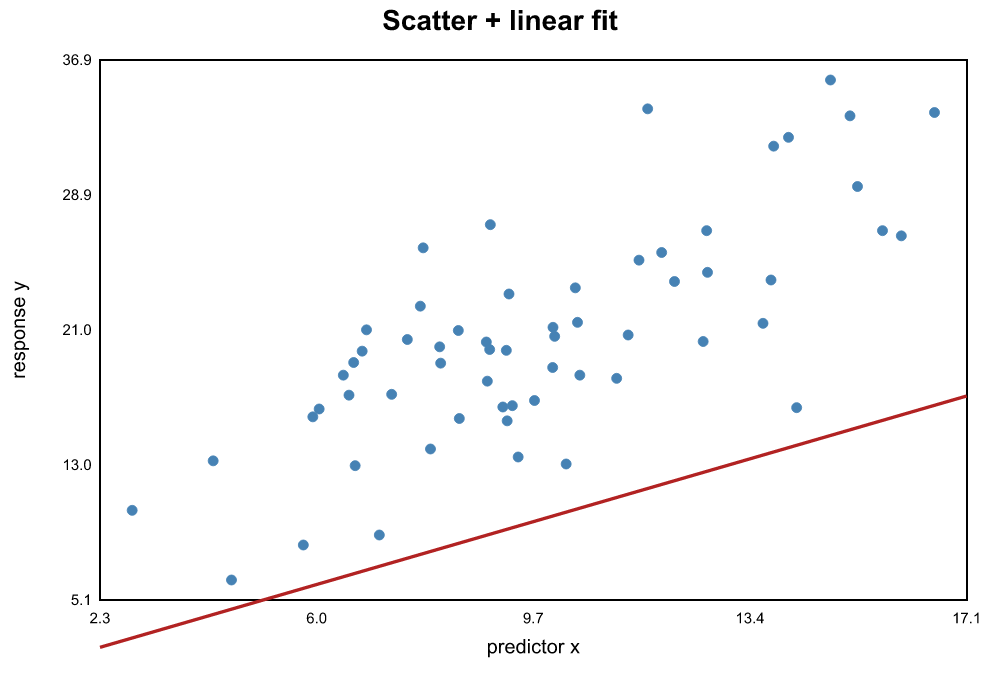
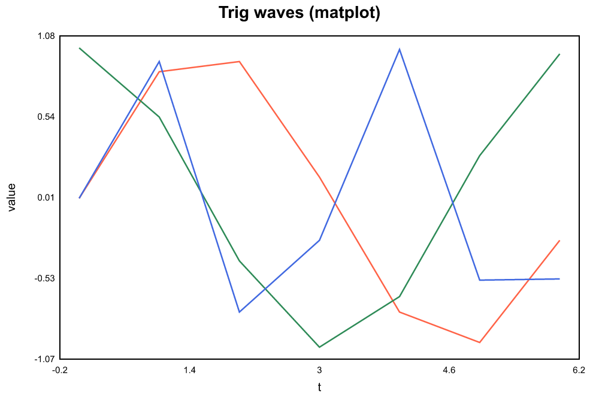
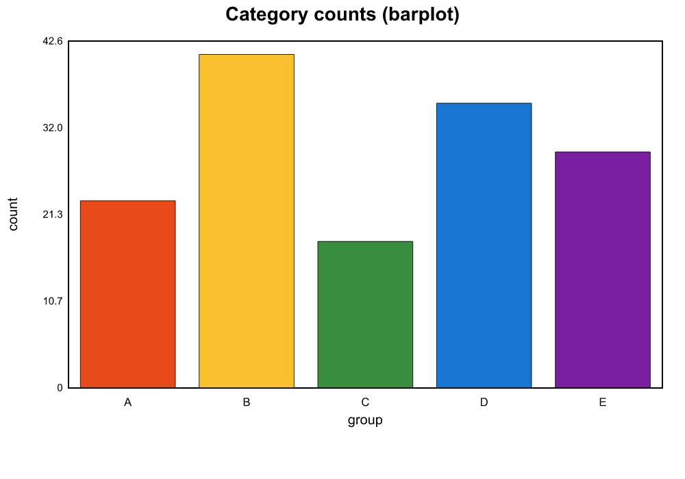
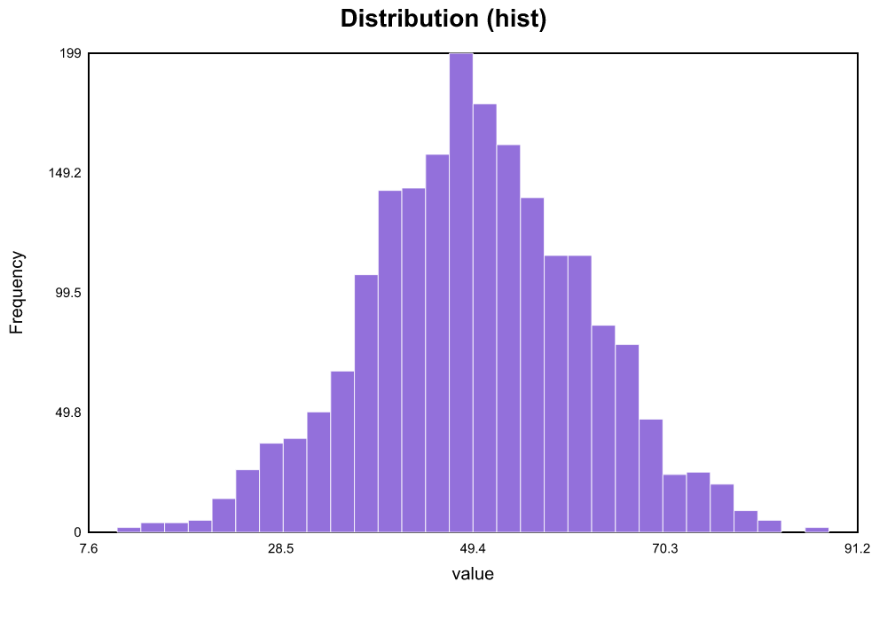
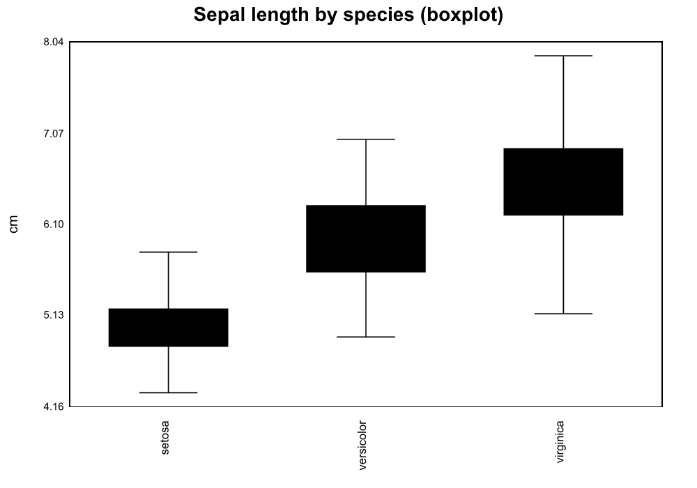
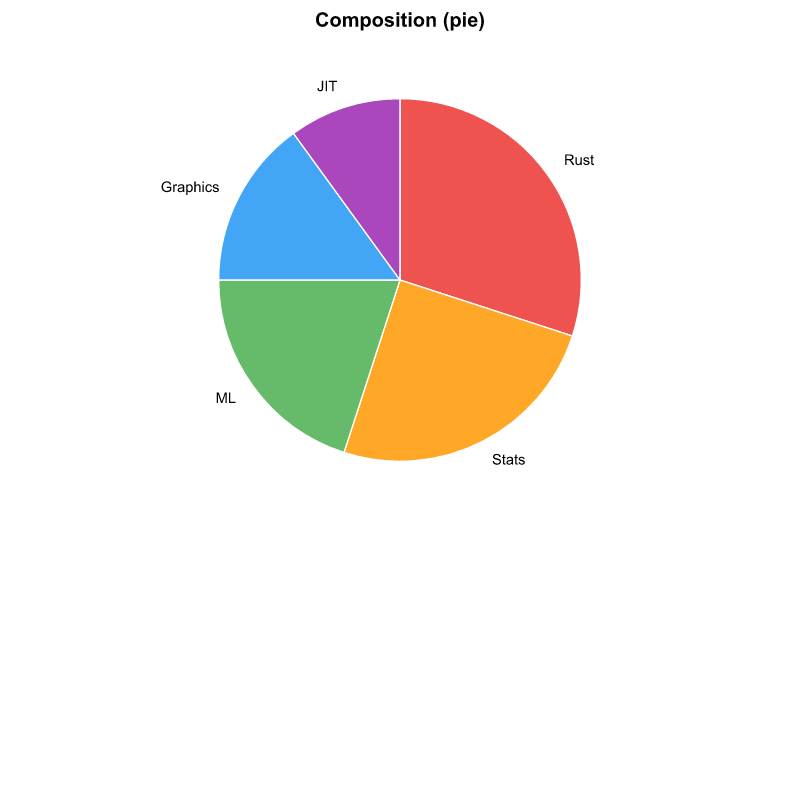

<p align="center">
  
</p>

<h1 align="center">Ardon-R2</h1>

<p align="center"><strong>Inspired by R. Built on Rust.</strong><br>
<em>An AI-Assisted Project. v0.3.4.</em></p>

---

**A ground-up reimplementation of statistical computing in Rust** — a single
small binary that speaks R's language (vectors, data frames, formulas,
`lm`/`glm`/`aov`, S3-style dispatch), ships a native desktop GUI, built-in
machine learning, a Cranelift JIT for your own functions, and automatic
parallelism — with **zero C, C++, or Fortran** anywhere in the stack and no
packages to install.

> The dominant inefficiencies in today's AI stack are not the math — they're
> the glue between languages, the copies between memory regions, the GIL, the
> dependency mess, and the silent-failure culture. R2 is built to remove them
> at the foundation, not paper over them with another wrapper.

R2 takes R's best ideas and rebuilds them from scratch with modern
performance and Rust-only dependencies. The numbers are **R-identical to ~7
significant figures** (see [PERFORMANCE.md](PERFORMANCE.md)); the whole thing
is one ~6 MB binary that builds the same on Linux, Windows, and macOS, x86
and ARM. This README is a **map of the project** — what each folder and file
holds, and where to look next.

## Showcase

> Drop your own GUI / CLI captures into [`screenshots/`](screenshots) — the
> graph images below are generated by [`samples/graph_gallery.r2`](samples/graph_gallery.r2).

| Desktop GUI (`R2Gui`) | Console (`r2`) |
|---|---|
|  |  |

**Graphs** — one example of each plot type (run `r2 samples/graph_gallery.r2`):

| | | |
|---|---|---|
|  |  |  |
|  |  |  |

## Why R2?

| | R | Python (scikit-learn) | R2 |
|---|---|---|---|
| Install size | 200+ MB | 5–8 GB | **~6 MB** |
| Setup time | minutes | hours (pip conflicts) | **0 seconds** |
| ML packages needed | 5–10 installs | 3–5 installs | **0 (built-in)** |
| Matrix multiply speed | 1× (ref BLAS) | 1× (NumPy) | **up to 22× faster** |
| Numerical accuracy vs R | — | — | **~7 sig figs (identical)** |
| Cloud required? | No | Often yes | **No** |

## Quick start

```bash
cargo build --release          # needs Rust 1.70+
./target/release/r2            # REPL          (Windows: .\target\release\r2.exe)
./target/release/r2 samples/smoke.r   # run a script
```

Prebuilt installers: **Windows** — `installer/Output/R2-Setup-*.exe`;
**Linux** — see [INSTALL_LINUX.md](INSTALL_LINUX.md) (one-shot script for CLI + GUI).

## What's in this repo

| Path | What you'll find |
|------|------------------|
| **[`samples/`](samples)** | Programs you can run to **test R2 on your machine and cross-check against R**. `smoke.r` runs on *both* R and R2 (compare the output); `capabilities.r2` tours the R2-specific features; `graph_gallery.r2` draws the plots above. **Found a mismatch or error? Please [open an issue](https://github.com/devendratandle/Ardon-R2/issues).** |
| **[`PERFORMANCE.md`](PERFORMANCE.md)** | The R-vs-R2 benchmarks + accuracy. Accuracy is **identical to R to ~7 significant figures**; where R2 is faster it's typically **1.5×–25×** (matrix multiply, the apply family, fused math-JIT loops), with R winning some memory-bandwidth-bound single ops. |
| **[`benchmarks/`](benchmarks)** | The runnable benchmark harness (tuned parallel `.R`/`.r2` files) behind PERFORMANCE.md — reproduce the numbers yourself. |
| **[`FUNCTIONS.md`](FUNCTIONS.md)** | Complete reference for the 400+ built-in functions. |
| **[`CHANGELOG.md`](CHANGELOG.md)** | Per-version history — what functions were added and what problems were fixed, release by release. |
| **[`docs/ARCHITECTURE.md`](docs/ARCHITECTURE.md)** | The compiler / runtime / IR / JIT / scheduler design — current state **and** the forward plan. Start here for *how it works*. |
| **[`docs/`](docs)** | `KNOWN_LIMITATIONS.md`, `LIBRARY_ARCHITECTURE.md`, and planned-design notes (GUI framework, mobile port, BLAS dispatch). |
| **[`VISION.md`](VISION.md)** | Why R2 exists — the Green-AI / efficiency thesis. |
| **[`INSTALL_LINUX.md`](INSTALL_LINUX.md)** | Linux install guide (CLI + GUI), prebuilt or from source. |
| **[`screenshots/`](screenshots)** | Graph gallery output + your GUI/CLI screenshots. |
| **[`crates/`](crates)** | The source — ~25 focused crates (`r2-parser` → `r2-types` → `r2-engine` → domain crates → `r2-kernel` → `r2-arrow`). Split small, on purpose, so logic is easy to locate. |

## Highlights

- **400+ built-in functions** — stats, ML, data manipulation, graphics, time series — no packages to install.
- **Statistics**: `lm`/`glm`/`aov` (incl. repeated-measures `Error()`), `t.test`/`cor.test`/`shapiro.test`, Hotelling's T², MANOVA (Wilks/Pillai/Hotelling-Lawley/Roy).
- **Machine learning, built in**: decision tree, random forest, gradient boosting, KNN, naive Bayes, PCA, K-means, cross-validation.
- **Graphics**: in-memory device, full `par()` multi-panel layouts, scatter/line/bar/hist/box/pie, PNG/SVG/PDF output, and a live browser plot viewer (`dev.view()`).
- **JIT-compiled user functions** — pure-arithmetic closures compile to native code via Cranelift; multi-op math fuses into one loop.
- **Pure-Rust math kernel** — hand-written DGEMM, SVD/QR/eigen, distributions; automatic serial/Rayon parallelism.

Want to see it run rather than read code? `r2 samples/smoke.r` and
`r2 samples/capabilities.r2`.

## Contributing

Good first issues, grouped by background:

- **If you know R well** — port a missing statistical test (Mann-Whitney U, Kruskal-Wallis, Friedman); port a CRAN dataset; write a help topic; or run `samples/smoke.r` on R and R2 and file any behaviour mismatch.
- **If you know Rust well** — extend the JIT to a new pattern; add a builtin to the parallel apply path; add a new SVG plot type; or improve the linear-algebra kernels.

Open the issue first so we can scope it together. See
[CONTRIBUTING.md](CONTRIBUTING.md) for the workflow and [CLA.md](CLA.md) for
the contributor agreement.

## License

AGPL v3 — Created by Devendra Tandale. An AI-assisted project.
